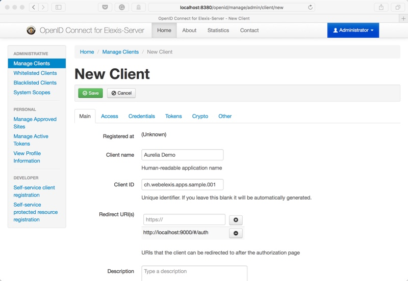
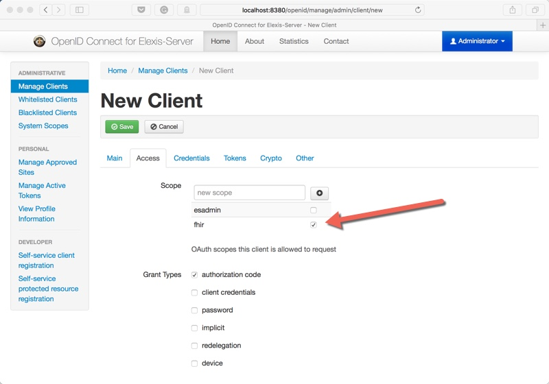
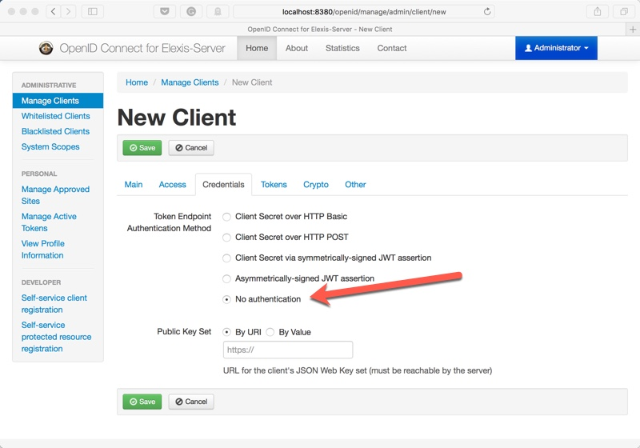
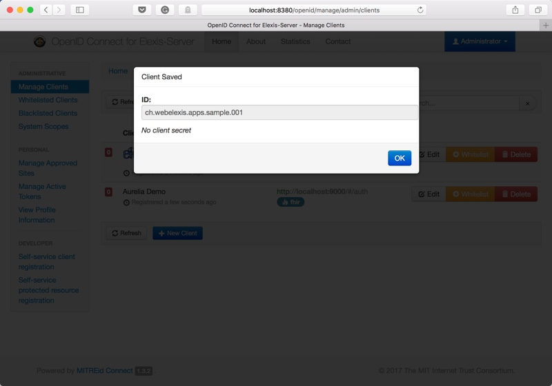
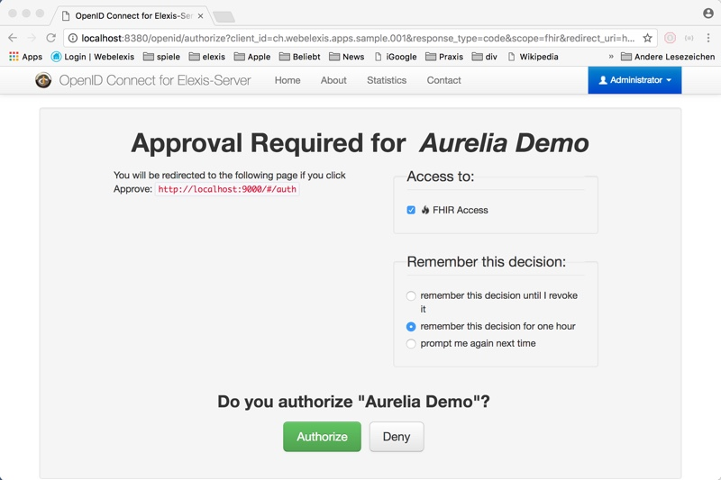
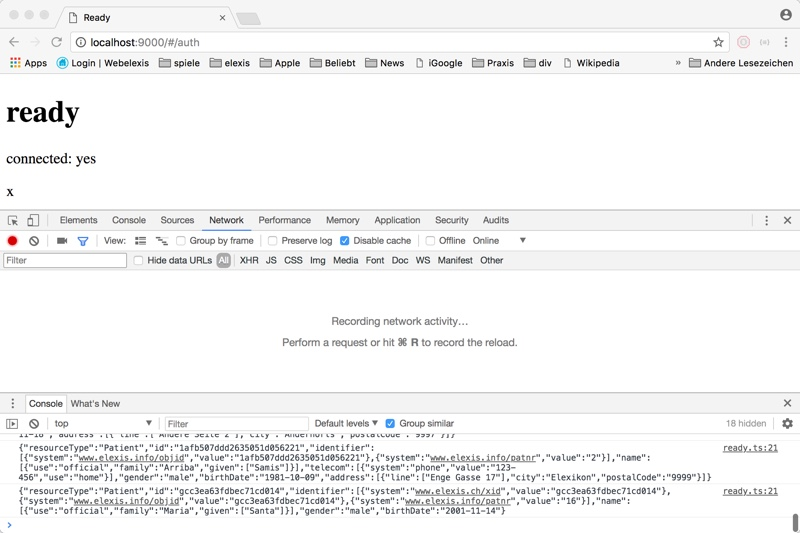

---
pagetitle: Elexis Server Programmer's Handbook
title:
- type: main
  text: Elexis Server Programmer's Handbook
- type: subtitle
  text: How to setup Elexis Server and build apps to access it.
creator:
- role: author
  text: Gerry Weirich and others
date: 2018-04-24
lang: en
identifier:
rights: Copyright (C) 2018. All rights reserved. 
stylesheet: style.css
cover-image: img/cover.jpg 
...


## Purpose of this book  and intended audience

This book is about creating apps to access the Elexis Server. It is not about programming the server itself. Some basic knowledge of JavaScript and REST is assumed.

## Prerequisites 

### Install Homebrew, NodeJS and Aurelia

#### macOS

```bash
/usr/bin/ruby -e "$(curl -fsSL 
 https://raw.githubusercontent.com/Homebrew/install/master/install)"
brew install nodejs
npm install -g aurelia-cli
```

#### Linux

```bash
curl -o- https://raw.githubusercontent.com/creationix/nvm/v0.33.11/install.sh | bash
nvm install 8
npm install -g aurelia-cli
```

### Install Docker

See the [Docker Website](http://docker.io)

### Quick walkthrough with our sample Aurelia project

This will guide you to a very simple Aurelia Starter to connect with the Elexis Server. No bells and whistles, just a bare bones connector to demonstrate, how the principle works.


* Create new Aurelia project

```bash
cd Documents\
au new es-aurelia-sample
```

* The wizard will walk through a series of questions. Here the answers:

3,1,2,1,3,1,1,1,1

* Then, install the smart-on-fhir client:

```bash
au install fhirclient
```

* Some modifications of aurelia_project/aurelia.json are required: In the section 'dependencies', replace `fhirclient' with:

```json
{
    "name": "fhirclient",
    "path": "../node_modules/fhirclient",
    "main": "fhir-client"
}
```

Please use the source code at `es-aurelia-sample/src` as a reference for the rest of this chapter.

## Launch Elexis Server and register the app

`docker run -e DEMO_MODE='true' -e TZ=Europe/Zurich -p 8380:8380 -p 8480:8480 -p 7234:7234 --name elexis-server medevit/elexis-server`

```{.einschub}
On subsequent starts, use `docker start -ia elexis-server` instead to keep any modifications you made in earlier runs. Read the docuentation on `docker commit` to learn how to persist a changed state in a new container.
```

go to [http://localhost:8380/openid](http://localhost:8380/openid) and log in with the Username **Administrator** and the password **admin**.

add a **new client**. 

On the main-page, enter a **Client Name** (any name will do) and set the address **http://localhost:9000/#/auth** as a redirect address. 



On the access-page, add ad least the *fhir* sope.



on the credentials-page, select "no authentication" for now.



click **save** and make sure, the correct client ID is displayed.




## Launch the sample app and connect with the server

```bash
au run --watch.
```

* Navigate to: `http://localhost:9000`.

* Click *connect*

If you do this the first time, you'll be requested to grant access for this app to the Elexis Server.



The App should connect with the server and output a patent list in the log.




